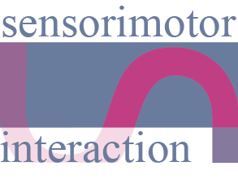

<div id="top"></div>


<!-- PROJECT SHIELDS -->
<!--
*** I'm using markdown "reference style" links for readability.
*** Reference links are enclosed in brackets [ ] instead of parentheses ( ).
*** See the bottom of this document for the declaration of the reference variables
*** for contributors-url, forks-url, etc. This is an optional, concise syntax you may use.
*** https://www.markdownguide.org/basic-syntax/#reference-style-links
-->
[![Contributors][contributors-shield]][contributors-url]
[![Forks][forks-shield]][forks-url]
[![Stargazers][stars-shield]][stars-url]
[![Issues][issues-shield]][issues-url]
[![MIT License][license-shield]][license-url]


<!-- PROJECT LOGO -->
<br />
<div align="center">
  <a href="https://sensint.mpi-inf.mpg.de/">
    
  </a>

<h3 align="center">Haptic Servos - Motion Coupled Vibrations</h3>

  <p align="center">
    Self-Contained Vibrotactile Rendering System for Creating or Augmenting Material Experiences
    <br />
    <b>We love to get your feedback. Please fill this for to prvide feedback and sign up for our mailing list: https://forms.gle/Dh4iDR7DPDSnXZQTA</b>
    <br />
    <br />
    <a href="https://github.com/sensint/Servo_Haptics/issues">Report Bug</a>
    ·
    <a href="https://github.com/sensint/Servo_Haptics/issues">Request Feature</a>
  </p>
</div>


## About The Project

![Banner images][banner-image]

<!--Add a summary of the project.-->

<p align="right">(<a href="#top">back to top</a>)</p>


### Built With

* [Teensyduino](https://www.pjrc.com/teensy/teensyduino.html)
* [PlatformIO](https://platformio.org/)

<p align="right">(<a href="#top">back to top</a>)</p>


## Getting Started

Download the code from the GitHub website or clone repo using your favorite git-client software or with the following command:

   ```sh
   git clone https://github.com/sensint/Servo_Haptics.git
   ```


### Firmware

We provide the firmware for two build systems - Teensyduino (based on Arduino IDE) and PlatformIO.

The firmware was tested with the following microcontrollers:

- Teensy 3.5
- Teensy 4.1


#### Teensyduino

The easiest way to get up and running with the firmware is Teensyduino.

##### Prerequisites

Download and install the [Teensyduino](https://www.pjrc.com/teensy/td_download.html) software for your operating system. All needed libraries are included in the basic installation.

##### Build and Upload

1. Open the `HapticServo.ino`
    1. navigate in your file manager (Win: Explorer, macOS: Finder) to the repository's folder `firmware/Teensyduino/MotionCoupledVibrations` and then double-click the `ino` file
    2. use the Teensyduino menu (`File -> Open`) or the keyboard shortcut (Win: `Ctrl+O`, macOS: `Cmd+O`) and navigate to the repository's folder `firmware/Teensyduino/MotionCoupledVibrations` and then select the `ino` file
2. connect the Teensy with your computer via USB
3. configure the Teensyduino
    1. select the correct board (Teensy version) from `Tools -> Board -> Teensydunio`
    2. select the correct serial port from `Tools -> Port`
4. click the upload button (arrow) in the Teensyduino IDE

<p align="right">(<a href="#top">back to top</a>)</p>


##### Control

The Haptic Servo is designed to be compatible with servo hardware and software. Using servo-commands you can fine-tune the tactile experience. You can find an example of how to do this in 'ServoControl.ino'


#### PlatformIO

##### Prerequisites

##### Build and Upload

<p align="right">(<a href="#top">back to top</a>)</p>


### Hardware

This project is based on the Teensy microcontroller and the [PT8211 Audio Kit](https://www.pjrc.com/store/pt8211_kit.html).

<p align="right">(<a href="#top">back to top</a>)</p>


## Usage

<!--Use this space to show useful examples of how a project can be used. Additional screenshots, code examples and demos work well in this space. You may also link to more resources.-->

<p align="right">(<a href="#top">back to top</a>)</p>


## Roadmap

See the [open issues](https://github.com/sensint/Servo_Haptics/issues) for a full list of proposed features (and known issues).

### Firmware

- [ ] ...


### Hardware

- [ ] ...

<p align="right">(<a href="#top">back to top</a>)</p>


## Contributing

Contributions are what make the open source community such an amazing place to learn, inspire, and create. Any contributions you make are **greatly appreciated**.

If you have a suggestion that would make this better, please fork the repo and create a pull request. You can also simply open an issue with the tag "enhancement".
Don't forget to give the project a star! Thanks again!

1. Fork the Project
2. Create your Feature Branch (`git checkout -b feature/AmazingFeature`)
3. Commit your Changes (`git commit -m 'Add some AmazingFeature'`)
4. Push to the Branch (`git push origin feature/AmazingFeature`)
5. Open a Pull Request

<p align="right">(<a href="#top">back to top</a>)</p>


## License

Distributed under the MIT License. See `LICENSE.txt` for more information.

<p align="right">(<a href="#top">back to top</a>)</p>


## Contact

Sensorimotor Interaction Group - [website](https://sensint.mpi-inf.mpg.de/) - [@sensintgroup](https://twitter.com/sensintgroup)

Project Link: [https://github.com/sensint/Servo_Haptics](https://github.com/sensint/Servo_Haptics)

<p align="right">(<a href="#top">back to top</a>)</p>


## Acknowledgments

* Othneil Drew for [Best-README-Template](https://github.com/othneildrew/Best-README-Template)

<p align="right">(<a href="#top">back to top</a>)</p>


<!-- MARKDOWN LINKS & IMAGES -->
<!-- https://www.markdownguide.org/basic-syntax/#reference-style-links -->
[contributors-shield]: https://img.shields.io/github/contributors/sensint/Servo_Haptics.svg?style=for-the-badge
[contributors-url]: https://github.com/sensint/Servo_Haptics/graphs/contributors
[forks-shield]: https://img.shields.io/github/forks/sensint/Servo_Haptics.svg?style=for-the-badge
[forks-url]: https://github.com/sensint/Servo_Haptics/network/members
[stars-shield]: https://img.shields.io/github/stars/sensint/Servo_Haptics.svg?style=for-the-badge
[stars-url]: https://github.com/sensint/Servo_Haptics/stargazers
[issues-shield]: https://img.shields.io/github/issues/sensint/Servo_Haptics.svg?style=for-the-badge
[issues-url]: https://github.com/sensint/Servo_Haptics/issues
[license-shield]: https://img.shields.io/github/license/sensint/Servo_Haptics.svg?style=for-the-badge
[license-url]: https://github.com/sensint/Servo_Haptics/blob/master/LICENSE
[banner-image]: assets/img/banner_temp.PNG
